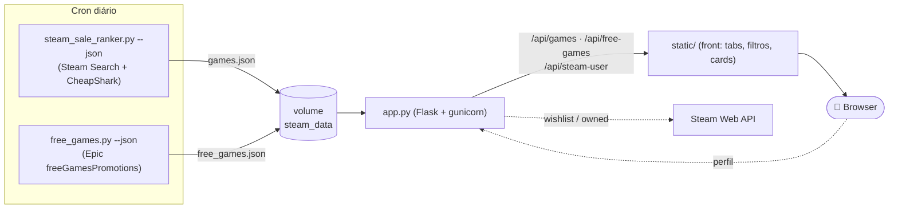

<div align="center">

# 🎮 Steam Sale Ranker

**Encontra as melhores promoções da Steam por qualidade real — não só pelo tamanho do desconto.**

Um ranker que combina avaliação dos jogadores, popularidade e desconto num **score de 0 a 10**,
compara com a **sua wishlist** e ainda rastreia os **jogos grátis da Epic**.

[**▶ Demo ao vivo**](https://gamepromo.eep0x10.tech) · feito em Python + Flask, atualizado 1×/dia


</div>

---

## ✨ O que faz

- 🏆 **Ranking por qualidade real** — score 0–10 que pondera *quão boas são as reviews*, *quantas são* e *quanto está de desconto*. Um jogo nota 9 com 500 mil reviews vale mais que um "95%" com 60 reviews.
- 🎯 **Mostra só a nata** — por padrão exibe os jogos **score 7–10**; o resto fica num *"Ver mais"* ao fim de cada bloco de avaliação.
- 🔎 **Filtros e busca** — por nome, desconto mínimo, avaliação mínima, e ordenação (score, maior desconto, mais reviews, melhor avaliação, menor preço).
- 🏷️ **Legenda clicável** — clique em **NEW**, **Baixa histórica** ou **Wishlist** pra filtrar só aqueles jogos.
- ❤️ **Compara com a sua wishlist** — cole o link do seu perfil Steam e os jogos da sua lista de desejos em promoção ficam grifados. **Sem precisar de API key.**
- 🟡 **Baixa histórica** — destaca em amarelo os jogos no **menor preço de todos os tempos** (via CheapShark).
- 🟢 **NEW** — destaca em verde o que **entrou em promoção hoje** (compara com a geração de ontem).
- 🎁 **Aba de jogos grátis** — os *gratuitos pra resgatar e ficar* da **Epic Games Store**, com "grátis agora", "em breve" e **histórico** do que já passou.

---

## 🧮 Como o score funciona

```
score (0–10) = 10 × qualidade × (0.75 + 0.25·fama) × (0.80 + 0.20·desconto)
```

| Fator | O que é | Por quê |
|---|---|---|
| **qualidade** | Limite inferior de **Wilson 95%** da proporção de reviews positivas | Junta *% positivas* **e** *nº de reviews* num número só, com confiança estatística. 95% de 200 reviews vale **menos** que 95% de 200 mil — resolve o hype de baixa amostragem. É o **núcleo** do score. |
| **fama** | `log10(reviews)` saturando perto de 100k | Popularidade conta, mas como **modificador suave** (×0.75–1.0): não domina nem zera um bom jogo. |
| **desconto** | `% de desconto` | Outro modificador suave (×0.80–1.0): bom negócio sobe, mas qualidade vem primeiro. |

**Calibração** (exemplos reais da fórmula):

| Jogo | Reviews | Desconto | Score |
|---|---:|---:|---:|
| Joia AAA · 97% positivas · 500k reviews | 500 000 | 70% | **9.1** |
| Nicho excelente · 95% · 800 reviews | 800 | 75% | **7.9** |
| Muito positivo · 88% · 20k reviews | 20 000 | 50% | **7.6** |
| Hype · 95% mas **só 60 reviews** | 60 | 80% | **7.0** ⬅ confiança puxa pra baixo |
| Mediano · 70% · 2k reviews | 2 000 | 80% | **6.0** |
| Fraco · 50% · 200 reviews | 200 | 90% | **3.7** |

Os jogos são agrupados pelos **blocos oficiais de avaliação da Steam**:

| Bloco | Critério |
|---|---|
| Overwhelmingly Positive | ≥ 95% com 500+ reviews |
| Very Positive | 80–94% com 500+ reviews |
| Mostly Positive | 70–79% |
| Mixed | 40–69% |
| Mostly Negative | 20–39% |
| Overwhelmingly Negative | < 20% com 500+ reviews |

> Só entram jogos com **≥ 2.000 reviews** e **≥ 15% de desconto** (ignora obscuros e promoções irrelevantes).

---

## ❤️ Comparação com o perfil Steam

Cole a URL do seu perfil (`steamcommunity.com/id/...`, `/profiles/...` ou só o nome) e a app:

- **Wishlist** → busca via `IWishlistService/GetWishlist/v1` (endpoint público, **sem API key**) e grifa em azul os seus desejados que estão em promoção.
- **Jogos que você já tem** *(opcional)* → como a Steam fechou o acesso anônimo à biblioteca em 2024, remover os que você já possui precisa de uma **API key opcional** (`IPlayerService/GetOwnedGames`). Sem a key, a comparação de wishlist funciona normalmente.

> 🔒 **Privacidade:** nada é armazenado no servidor. O perfil é consultado server-side só naquela requisição (evita CORS) e a API key, se informada, é usada só ali e descartada.

---

## 🎁 Jogos grátis (Epic)

Lê o feed público `freeGamesPromotions` da Epic (sem API key, preço/locale BR) e separa:

- **Grátis agora** — só os realmente *100% off* (descarta as promos pagas que a Epic mistura no mesmo feed).
- **Em breve** — os já anunciados pra próxima rotação.
- **Histórico** — log **append-only** de tudo que já ficou grátis (com data de quando apareceu).

> PSN e Prime ficam de fora: não há fonte pública estável (os alvos bloqueiam bots e os títulos do PS Plus exigem assinatura).

---

## 🏗️ Arquitetura



O gerador roda em **2 fases**: publica a lista na hora (fase 1) e depois enriquece com baixa histórica via CheapShark (fase 2, mais lenta), republicando. A app Flask só serve os JSONs + o frontend estático e faz o proxy do perfil Steam.

---

## 🚀 Rodando localmente

### CLI (só o gerador, no terminal)

```bash
pip install -r requirements.txt

python steam_sale_ranker.py 12 --json data/games.json   # gera o JSON da lista
python free_games.py --json data/free_games.json         # gera os grátis da Epic
python steam_sale_ranker.py 12                           # tabela colorida no terminal
```

### App completa (Docker)

```bash
# 1) app web (serve front + APIs na porta 8000)
docker build -t steam-sale-app .
docker run -d --name gamepromo -p 8000:8000 -v steam_data:/app/data steam-sale-app

# 2) gerador (imagem única com os dois scripts)
docker build -f Dockerfile.gen -t steam-gen .
docker run --rm -v steam_data:/app/data steam-gen 12 --json data/games.json
docker run --rm --entrypoint python -v steam_data:/app/data steam-gen \
    free_games.py --json data/free_games.json
```

Abra **http://localhost:8000**. (Sem `games.json` ainda, a lista mostra um aviso até o gerador rodar.)

---

## 🌐 Deploy em produção

Pensado pra rodar atrás de um **nginx-proxy** (rede Docker), com a app e o gerador compartilhando o volume `steam_data`:

```yaml
# docker-compose.prod.yml (resumido)
services:
  gamepromo:
    build: .
    environment:
      - VIRTUAL_HOST=gamepromo.seu-dominio
      - VIRTUAL_PORT=8000
    volumes: [steam_data:/app/data]
    networks: [web]
```

Os dados são atualizados por **cron** (uma imagem `steam-gen` serve os dois jobs):

```cron
0 3 * * *  docker run --rm -v steam_data:/app/data steam-gen 12 --json data/games.json
0 4 * * *  docker run --rm --entrypoint python -v steam_data:/app/data steam-gen free_games.py --json data/free_games.json
```

---

## 🔌 Endpoints da API

| Rota | Descrição |
|---|---|
| `GET /` | Frontend (abas Promoções / Grátis) |
| `GET /api/games` | JSON da lista rankeada (gerado pelo cron) |
| `GET /api/free-games` | Jogos grátis: `current` / `upcoming` / `history` |
| `GET /api/steam-user?profile=<url>&key=<opcional>` | Resolve o perfil e devolve `wishlist` + `owned` |
| `GET /healthz` | Healthcheck |

---

## 📦 Configuração

| Variável | Padrão | Descrição |
|---|---|---|
| `DATA_FILE` | `data/games.json` | Caminho do JSON da lista |
| `FREE_FILE` | `data/free_games.json` | Caminho do JSON dos grátis |
| `PORT` (via gunicorn) | `8000` | Porta da app |

Constantes do gerador (em `steam_sale_ranker.py`): `MIN_REVIEWS=2000`, `MIN_DISCOUNT=15`, `COUNT_PER_PAGE=50`, rate limit CheapShark `2 req/s`.

---

## 🙏 Fontes de dados

- **Steam Store Search API** — jogos em promoção e contagem de reviews
- **CheapShark API** — menor preço histórico (rate limit respeitado: 2 req/s)
- **Steam Web API** (`IWishlistService` / `IPlayerService`) — wishlist e biblioteca
- **Epic Games** (`freeGamesPromotions`) — jogos grátis

Projeto pessoal, sem fins comerciais. Marcas e dados pertencem aos seus respectivos donos.
